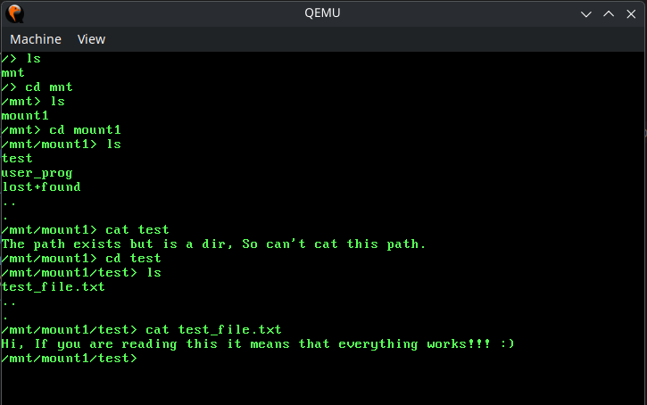

# BIOS

### ~~Basic Input/Output System~~ Bareket Itai Operating System

## Overview

This project is an educational operating system built from scratch for the x86\_64 architecture. It is inspired by Linux and aims to provide a deeper understanding of low-level system programming, including kernel development, memory management, drivers, and basic networking.

## Features

- **boot/**: Bootloader source code
    - Enabling A20
    - 64bit (Long Mode)
    - 64bit GDT + TSS
    - Initializing paging

- **build/**: Build files including `boot.bin`, `kernel.elf`, and `disk.img`.

- **kernel/**: Kernel source code
  - **arch/x86_64/**: Architecture-specific code
    - IDT, ISR, IRQ
    - I/O - VGA
    - MMU (Paging)
    - PIC + PIT

  - **drivers/**: Drivers for devices:
    - VGA
    - PCI
    - AHCI + SATA
    - EXT2 - Only reading is implemented
    - Keyboard
  - **net/**: Networking source code
    - RTL8139 NIC
    - Ethernet
    - ARP
    - IPv4
    - UDP
    - DNS

  - **process/**: Processes source code
    - Static ELF Loader
    - Process context switching

  - **sched/**: Scheduling source code - Not finished

- **libc/**: Minimal C standard library
  - **endian/**: Endianness conversions
  - **memory/**: Memory allocation
    - `malloc`
    - `free`
  - **stdio/**: Input/output functions
    - `printf`
    - `scanf`, `fgets`
  - **stdlib/**: General functions
    - random: `srand`, `rand`
    - `atoi`, `itoa`
  - **string/**: String operations
    - `memcmp`, `strlen`, etc.
  - **random/**: Random related functions

- **user/**: User-space applications and shell
    - **shell/**: Shell source code

---

## Demo
The os loads a shell program as a user program from disk parses the elf and executes it
The shell program allows to read files from the disk, Using commands: ls, cat, cd, clear, pwd, shutdown, echo, nslookup, bc(Calculator)
The disk contains an ext2 filesystem which is mounted under /mnt/mount1




Networking might have some bugs and the communication with nic will stop working after afew minutes from boot


--- 

## Requirements

- **QEMU** for emulation.
- **GNU Make** for building the project.
- **Cross-compiler** targeting x86\_64.


## Build

1. Set up a cross-compiler by following [`docs/crosscompiler.md`](./docs/crosscompiler.md).
2. Build the project:
   ```sh
   make
   ```


## Run
start by running: ```make build``` followed by ```make ron```

### Online (includes networking, requires `sudo`)
1. Setup Networking:
    ```sh
    make nsetup
    ```
2. Run online:
   ```sh
   make ron
   ```
Note: QEMU produces `dump.dat` with network sniffs during online running.

### Offline
1. Run offline:
   ```sh
   make roff
   ```


## Clean
```sh
make clean
```

---

## Documentation - some are under docs folder

- **Conventions.md**: Coding style and conventions used.
- **DiskMemoryLayout.md**: Disk layout description.
- **Heap.md**: Kernel heap implementation details.
- **ProcessMemoryLayout.md**: Process memory layout description.
- **README.md**: This file

## License

This project is licensed under the terms specified in the `LICENSE` file.

## Contributing

Contributions are welcome!

---

Feel free to explore, experiment, and learn from this project!


